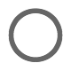

# KnotFont

&emsp;&emsp;&emsp;&emsp;&emsp;&emsp;&emsp;&emsp;&emsp;

### 1. What is it?

The ***KnotFont*** is a font containing a representation of all the knot projections reflected in the [Rolfsen Knot Table](http://katlas.org/wiki/The_Rolfsen_Knot_Table) up to 7 crossings. [Total: 15 knots]

It is **not** meant to type text. Yet, for typing clarity, it contains a vague representation of the decimal system, the letters *k* and *c*, and the *white space* (space bar).

### 2. How to type a knot?

Typing the knot **n_m** is as easy as:

`k` + `n` + `c` + `m`

This can be read as "**k**not with **n** **c**rossings, number **m**".

##### Examples

- Trivial knot: `k0c1`
- Trefoil: `k3c1`
- Knot 7_4: `k7c4`

### Support

If you want me to expand the font to links please support me.